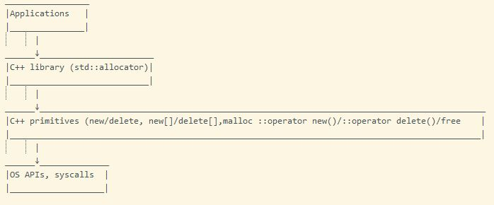
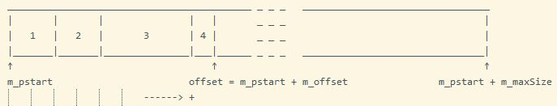
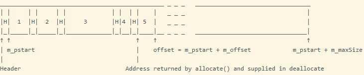
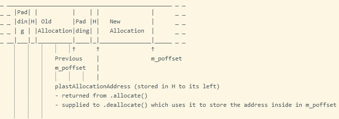
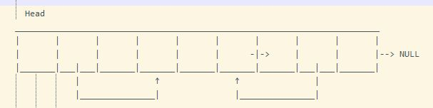

<h1 align="center">
	<a href="https://github.com/KeyC0de/AllocatorsGalore">Allocators Galore</a>
</h1>
<hr>


I was always fascinated by memory allocation. Allocators are strange creatures in the C++ bestiary, but they are very interesting.

This is the culmination of my efforts creating some of the most popular memory allocators:

- Pre-C++11 default allocator (`DefaultAllocator` project)
- C++11 compatible allocator replacement (`Allocators` project)
- C++11 compatible aligned allocator (`AlignedAllocator` project)
- Tracking allocator (default + tracks allocations) (`TrackingAllocator` project)
- Linear (aka Arena) allocator (`LinearAllocator`project)
- Stack Allocator (`StackALlocator` & `StackAllocatorTS` projects)
- Object Pool allocator (`ObjectPool` project)

They are designed to be cross platform and modern C++17 compliant.

Both serial as well as thread safe versions are included for almost all of them.

The code is commented and you should be able to follow along with no trouble. However for proper understanding you should at least read all that follows this introduction.


## Memory Layout of a program in C

A typical memory representation of C program consists of the primary following "sections" (logically different components):

1. <u>Text segment</u>: AKA code segment is one of the sections of a program in an object file or in memory, which contains executable instructions, as well as const variables. Read only segment.
2. <u>Initialized data segment</u>: usually called simply the Data Segment. A data segment is a portion of virtual address space of a program, which contains the global variables and static variables that are initialized by the programmer. Note that, data segment is not read-only, since the values of the variables can be altered at run time.
3. <u>Uninitialized data segment</u>: uninitialized data starts at the end of the data segment and contains all global variables and static variables that are initialized to zero or do not have explicit initialization in source code. Often called the .bss segment. Data in this segment is initialized by the kernel to arithmetic 0 before the program starts executing. Read/Write segment. Sometimes uninitialized data will be separated to two .bss segments, one for const uninitialized (read-only subsegment) data and one for non-const unitialized data (read/write subsegment).
4. <u>Stack</u>: The stack area traditionally adjoined the heap area and growing towards the opposite direction; when the stack pointer met the heap pointer, free memory was exhausted. Write only segment.
5. <u>Heap</u>: Heap is the segment where dynamic memory allocation usually takes place. Write only segment.

There can others of secondary importance..


## Free Store vs Heap

Both free store and heap refer to the computer's main memory locations where malloc (and family) and new acquire memory from. It is said that new acquires memory from the free store and malloc from the heap (not to be confused with the Data Structure). However, those places are almost always the same. Additionally the majority of times new uses malloc internally to allocate memory. Their distinction or even their definitions is not standardized by the C++ standard.

Bjarne's [opinion](https://zamanbakshifirst.blogspot.com/search/label/heap):</br>
Herb Sutter says: Its possible for new and delete to be implemented in terms of malloc and free, so technically, they could be the same memory area. However, as the standard doesn't specify this, its best to treat them separately, and not to mix malloc/delete or new/free.

Takeaway:

* Heap: A dynamic memory area that is allocated by malloc and deallocated by free.
* Free Store: A dynamic memory area that is allocated by new/new[] and deallocated by delete/delete[].

Practically these terms always refer to the same thing, in theory though they can differ.

## Memory Allocators

An allocator encpapsulates strategies for access/adressing, allocation/deallocation and possibly construction/destruction of objects. `std::allocator` is the default memory allocator for the C++ standard library containers. We can use our own custom allocator replacing it, in order to fine tune memory according to our needs and desires.

<i>Stepanov</i>: "I invented allocators to deal with Intel's memory architecture. They are not such bad ideas in theory - having a layer that encapsulates all memory stuff: pointers, references, ptrdiff_t, size_t. Unfortunately they cannot work in practice."

Pre-C++11 the allocator was bloated with unecessary stuff. To write a standard-conforming allocator since C++11, the library provides a construct called std::allocator_traits, which specifies that a custom allocator only needs to fulfill a minimal set of requirements to be used in a standard way.


### Minimal C++11 conforming allocator

<u>Allocator Restrictions</u></br>
- A C++11 compatible allocator must have only one template parameter T, which is the value of the underlying type to be allocated.
- C++11 allocators can be stateful. Previously all allocators were stateless (in theory).
- Smart pointers shouldn't be used with allocators. Instead raw pointers and iterators should be used.
- Since C++11 the restriction that custom allocators cannot contain state is lifted. Each container or another allocator-aware object stores an instance of the supplied allocator and controls allocator replacement through std::allocator_traits. Stateless allocators were forbidden prior to C++11.
- The C++ Standard forbids containers of const elements.
- Don't derive from std::allocator because it doesn't have a virtual destructor, no other virtual functions and thus no polymorphic behavior, which can introduce problems with object slicing if pointer to base class types are passed around, or destructed.

> From the standard 20.7.9.1 allocator members [allocator.members]:
Except for the destructor, member functions of the default allocator shall not introduce data races (1.10) as a result of concurrent calls to those member functions from different threads. Calls to these functions that allocate or deallocate a particular unit of storage shall occur in a single total order, and each such deallocation call shall happen before the next allocation (if any) in this order.

<p style="text-align: center;">
	
</p>

Ooppff, with that out of the way let's get to the code:

```
template <class T>
class MyAllocator
{
public:
    typedef T value_type;

	// these first three constructor versions must be defined (even if they do nothing) to allow for copy-constructions from allocator objects of other types.
    MyAllocator() noexcept;
    MyAllocator(const MyAllocator&) noexcept;  // copies must be equal
    template <class U>
        MyAllocator(const MyAllocator<U>& u) noexcept;  // requires: *this == MyAllocator(u)
	MyAllocator(MyAllocator&&) noexcept;  // not needed if copy ctor is good enough

    value_type* allocate(std::size_t);
    void deallocate(value_type*, std::size_t) noexcept;
};

template <class T, class U>
bool operator==(const MyAllocator<T>&, const MyAllocator<U>&) noexcept;

template <class T, class U>
bool operator!=(const MyAllocator<T>&, const MyAllocator<U>&) noexcept;
```

You might optionally consider making MyAllocator Swappable and put the following nested type in the allocator:

```
typedef std::true_type propagate_on_container_swap;
```

Additionally your allocator must be CopyConstructible and MoveConstructible to have any of the following four typedefs.

```
If propagate_on_container_copy_assignment{} is true, your allocator must be CopyAssignable.
If propagate_on_container_move_assignment{} is true, your allocator must be MoveAssignable.
If propagate_on_container_swap{} is true, your allocator must be Swappable.
```

If they exist, these operations should not propagate an exception out. However they do not need to be marked with noexcept.

It would be best to mark them as noexcept, such that traits like `std::is_nothrow_copy_constructible<Allocator<T>>` give the right answer.

```
using propagate_on_container_copy_assignment = std::false_type;
using propagate_on_container_move_assignment = std::false_type;
using propagate_on_container_swap = std::false_type;
using is_always_equal = std::is_empty<Allocator>;
```

As for the comparison operators these compare two allocator objects. The result of a comparison of two allocators must be true only if storage allocated from each can be deallocated via the other, with reflexive, symmetric and transitive relationship added in. In other words, if two allocators compare equal, that means that they can deallocate each other's allocated pointers.
If two instances of your allocators ca not do this, they must not compare equal to each other, else run time errors will result. However copies, even converting copies, are required to compare equal.


### Questions that demand answers:

Since C++17, from the standard:

> `T* allocate(size_t n);` "Returns: A pointer to the initial element of an array of storage of size `n * sizeof(T)`, aligned appropriately for objects of type T."

Compared to C++14, the sentence "It is implementation-defined whether over-aligned types are supported." Therefore we deduce that in C++17 `std::allocator` allocates aligned memory.

**?** If allocator instances always compare equal?</br>
Define a nested type alias `is_always_equal` set to `true_type`.

**?** If instances do not propagate on copy construction</br>
Define `select_on_container_copy_construction()` that returns a temporary value of your allocator type.

**?** If instances propagate on copy assignment,</br>
Define nested alias `propagate_on_container_copy_assignment` as `true_type`.

**?** If instances propagate on move assignment,</br>
Define nested alias `propagate_on_container_move_assignment` as `true_type`.

**?** If instances propagate on swap,</br>
Define nested alias `propagate_on_container_swap` as `true_type`.

So whenever you have an allocator for a certain type, you can check whether you can use it to deallocate memory of a different type without the need to rebind the allocator.


# Custom Allocators

The section you've been waiting for, we got to it at last.

There are various allocator types, categorized depending on their allocation and deallocation strategies with popular ones being the linear, stack and pool allocators.


## Linear Allocator

A linear allocator is the simplest and fastest type of allocator. It is basically a chunk of memory whereby using a pointer we simply 'move it forward' every time an allocation is made. This effectively increases the size of our allocated memory block. In this respect it is similar to a stack allocator. Total size of the memory block never changes after initialization. Internal fragmentation is kept to a minimum because all elements are sequentially inserted and the only fragmentation between them is the alignment.
Linear allocator adds no overhead per allocation and does not modify the pre-allocated memory buffer. This makes it ideal for high-performance applications or embedded low-power systems or for working with read-only memory. Due to its simplicity, it offers great performance. All operations are O(1) with only a few instructions.
Restriction: Due to the fact that we do not add per allocation overhead, we cannot properly support freeing memory at the pointer level while supporting variable alignment. When support for freeing memory is needed, other allocators are better suited.
Making a linear allocator thread safe, such that it can be used and manipulated across different threads is only a matter of making `top`, ie the 'stack' pointer atomic.

A linear allocator requires an arena, ie a memory pool to acquire its memory from and delegate the calls to allocate and deallocate to.

<p style="text-align: center;">
	
</p>

The above diagram depicts the method that new allocations have been made. We notice that 4 allocations were made, thus there are 4 allocated blocks. Before the starting address of an allocated block there might be space needed for alignment.

API:

```
`ctor` : initialize the allocator with size of the memory buffer m_maxSize
`dtor` : `free`s the entire allocated memory region
`allocate` : simply increments a value (m_offset) indicating the current buffer offset. Calls to this function simply "move" `m_offset` specifies bytes forward, plus any bytes that may be needed for alignment
				returns a pointer to the start of the allocated block aligned to given byte boundary
`deallocate` : does nothing. Individual deallocations cannot be made
```

Optionally:

```
`reset` : resets the offset to 0 (initialized state)
`init` : resets all state, including freeing memory if already acquired. Returns `m_maxSize` memory again to `m_pstart`. This is the only function where memory allocation is being made
```

Data members:

```
T* m_pstart : the start pointer of the memory chunk
std::size_t m_offset : the offset from m_pstart, indicating how many bytes have been allocated to the chunk by this allocator
std::size_t m_maxSize : the maximum size in Bytes given to the allocator in its constructor. This amount of bytes is going to be allocated later by init()
```

The allocator's identity is the value of its arena member. The identity is preserved by rebound-copies and verified with the equality and inequality operators. The only non-trivial operation of this allocator is to forward allocation calls to the arena

A linear allocator is aka 'arena' allocator. However, that name is overloaded and is also often associated with a number of other allocators which manage a fixed memory region (predominantly the stack allocator). Other times an 'arena' is used to mean a pre-allocated chunk of memory.


## Stack Allocator

This is a smart evolution of the Linear Allocator. The idea is to manage the memory as a Stack. So, as before, we keep a pointer to the current memory address and we move it forward for every allocation. However, we also can move it backwards when a free operation is done. The deallocations must occur in a LIFO order. If we allocate A and then B, we cannot deallocate A without deallocating B first. To deallocate memory the allocator checks if the address to the memory that you want to deallocate corresponds to the address of the last allocation made. If so the allocator accesses the allocation header, stored right before the passed address, and sets the offset back, basically replacing the pointer to the last allocation made with the one in the allocation header.
Operations are still very fast, we maintain the spatial locality principle and the fragmentation is still almost equally as low.

There are various ways to store the "offset pointer". Either as an integer number m_offset, or as a pointer m_poffset. I've found that as a pointer it works better and makes for a compatible interface with the other members.

<p style="text-align: center;">
	
</p>

The above diagram depicts the method that new allocations have been made. We notice that 5 allocations were made, thus there are 4 allocated blocks. Before the starting address of an allocated block there might be space needed for alignment also accounting storage for the Header.

A more in-depth look, 2 allocations so far:

<p style="text-align: center;">
	
</p>

An amount of padding per allocation is inevitable is necessary due to alignment. The bigger the alignment requirements the larger the padding will become.

API:

```
`ctor` : initialize the allocator with size of the memory buffer m_maxSize
`dtor` : `free`s the entire allocated memory region
`allocate` : moves the pointer up by the requested number of bytes plus any alignment bytes needed to align the address and store the allocation header, the allocation header provides the size of the allocation.
		returns a pointer to the start of the allocated block aligned to given byte boundary
				the header pointer is sizeof(Header) bytes before it
`deallocate` : to deallocate a block, the previous allocation start address, being safekeeped in the Header right before it, is stored in current m_poffset, effectively rendering all allocated data after that memory address "lost". In short it moves the m_offset backwards
```

Optionally:</br>
`reset` : resets the offset to 0 (initialized state)

Data members:

```
char* m_pdata;
char* m_poffset;
std::size_t m_maxSize;

struct Header final {
	std::size_t allocationAddress;
};
```

Some stack allocation techniques also use a double-ended stack where one kind of resource is loaded from the top and the other is loaded from the bottom. Perhaps LSR (Load and Stay Resident, the kind of thing that will be needed throughout the entirety of your game) from the top, and per-level data from the bottom.


## Memory Pools

Memory pools, also called fixed-size blocks allocation, is the use of pools for memory management that allows dynamic memory allocation comparable to malloc or C++'s operator new. As those implementations suffer from fragmentation because of variable block sizes, it is not recommended to use them in a real time system for performance reasons. A more efficient solution is preallocating a number of memory blocks with the same size called the memory pool. The application can allocate, access, and free blocks represented by handles at run time.


## Object Pool & Pool Allocator

The object pool pattern is a software creational design pattern that uses a set of initialized objects kept ready to use - a "pool" - rather than allocating and destroying them on demand. A client of the pool will request an object from the pool and perform operations on the returned object. When the client has finished, it returns the object to the pool rather than destroying it; this can be done manually or automatically. An object pool should be used for objects that are more expensive to create or destroy than to re-use.

Object pools employ one of three strategies to handle a request when there are no spare objects in the pool.

1. Fail to provide an object (and return an error to the client).
2. Allocate a new object, thus increasing the size of the pool. Pools that do this usually allow you to set the high water mark (the maximum number of objects ever used).
3. In a multithreaded environment, a pool may block the client until another thread returns an object to the pool.

If we don't want to waste time iterating through the array/pool of objects, the obvious answer is to not lose track of them. We could store a separate list of pointers to each unused object. Then, when we need to create an object, we remove the first pointer from the list and reuse the object it points to. Unfortunately, this would require us to maintain an entire separate array with as many pointers as there are objects in the pool. After all, when we first create the pool, all objects are unused, so the list would initially have a pointer to every object in the pool. It would be nice to fix our performance problems without sacrificing any memory. Conveniently, there is some memory already lying around that we can borrow - the data for the unused objects themselves. The answer is here, a 'union':

```
class Object
{
public:
	// ...
	Object* getNext() const {
		return m_state.next;
	}
	void setNext(Object* next) {
		m_state.next = next;
	}
private:
	int m_framesLeft;

	union {
		// State when it's in use.
		struct {
			double x, y;
			double xVel, yVel;
		} live;
		// State when it's available.
		Object* next;
	} m_state;
};
```

This essentiallly creates a free list. For it to work, we need to make sure the pointers are maintained when objects are created and destroyed. And, of course, we need to keep track of the list's head:

```
class ObjectPool
{
	// ...
private:
	Object* m_firstAvailable;
	// ...
};
```

When a pool is first created, all of the particles are available, so our free list should thread through the entire pool. The pool constructor sets that up:

```
ObjectPool::ObjectPool()
{
	// The first one is available.
	m_firstAvailable = &m_objects[0];

	// Each particle points to the next.
	for (int i = 0; i < POOL_SIZE - 1; i++)
	{
		m_objects[i].setNext(&m_objects[i + 1]);
	}

	// The last one terminates the list.
	m_objects[POOL_SIZE - 1].setNext(NULL);
}
```

If an object is coupled to the pool, ie the object is aware of the pool it is into, then we must ensure that the object can only be created by the pool, by making the pool a friend of the object class and making the Object class constructor private:

```
class Particle
{
	Particle()
		: m_inUse(false)
	{}						// we might be able to avoid storing an explicit "in use" flag. Many objects already retain some state that could be used to tell whether it is alive or not.
	bool m_inUse;			// for example, a particle may be available for reuse if its current position is offscreen.
public:
	friend class ParticlePool;
};

class ParticlePool
{
	Particle m_pool[100];
};
```

If objects are not coupled to the pool then objects of any type can be pooled. This is the big advantage. By decoupling objects from the pool, you may be able to implement a generic reusable pool class. Also The "in use" state must be tracked outside the objects. The simplest way to do this is by creating a separate field:

```
template <class TObject>
class ObjectPool
{
private:
	static const int POOL_SIZE = 100;

	TObject m_pool[POOL_SIZE];
	bool m_inUse[POOL_SIZE];
};
```

<u>Design</u>:

- Define a pool class that maintains a collection of reusable objects. Each object supports an "in use" query to tell if it is currently "alive". When the pool is initialized, it creates the entire collection of objects up front (usually in a single contiguous allocation) and initializes them all to the "not in use" state.
- A free list data structure (similar to a linked-list) of free blocks is maintained, but since all blocks are of the same size each free block only needs to store a pointer to the next one.
- Allocation simply removes the first element of the free list and returns it. Deallocation pushes it at the back. That is quite fast but you can only use it for pieces of a fixed size. If not you have fragmentation issues and therefore need a long time for finding the fitting piece.
- The memory pool does not free any memory until it is destructed, though it does re-use the memory slots that you destruct.
- Most pool implementations store the objects in an array of in-place objects. If all of your objects are of the same type, this is fine. However, if you want to store objects of different types in the pool, or instances of subclasses that may add fields, you need to ensure that each slot in the pool has enough memory for the largest possible object. When such largest object aren't that frequent you're wasting memory. In such cases consider splitting the pool into separate pools for different sizes of objects - most common implementation.

Data Structure:</br>
An array of Objects. Each object is a union containing:

1. storage for that object
2. a pointer to the next member in the 'list', which in memory it is in fact an array. The list allows us to keep track of the free blocks of memory and to reduce the space needed, the list is stored in the same free blocks

<p style="text-align: center;">
	
</p>

The free list doesn't have to be sorted. Its order is determined by how the allocations and deallocations are done.

API:

```
ctor : constructs the free linked list. Sets the first free member of the list
dtor : 
allocate() : takes/pops the first free block of the linked List
deallocate() : adds/pushes the element as the first element of the linked list
construct() : 
destroy() : 
```

Data members:</br>

```
union Object
{
	std::aligned_storage_t<sizeof(T), alignof(T)> m_storage;
	Object* next;
};
inline static std::size_t m_size = 0;
std::unique_ptr<Object[]> m_pool;
Object* m_nextFree;
```

Notes:

- Pool Allocator: A PoolAllocator uses an Object pool allocation strategy, it is basically an implementation of a memory pool.
- The pool allocator, just like an object pool allocates only big memory blocks and divides them in equally sized pieces. All free pieces are stored in a so called free list. Allocation simply removes the first element of the free list and returns it. Deallocation pushes it at the back. That is quite fast but you can only use it for pieces of a fixed size. If not you have fragmentation issues and therefore need a long time for finding the fitting piece.
- A big advantage of memory pools is having no need to align each allocation, since all allocations have the same size/alignment. Only the first block has to be aligned, this results in an almost non-existant memory overhead from alignments.
- object pools full of objects with dangerously stale state are sometimes called object cesspools and regarded as an anti-pattern.
- Criticism: Some publications do not recommend using object pooling with certain languages, such as Java, especially for objects that only use memory and hold no external resources. Opponents usually say that object allocation is relatively fast in modern languages with garbage collectors; while the operator new needs only ten instructions, the classic new - delete pair found in pooling designs requires hundreds of them as it does more complex work. Also, most garbage collectors scan "live" object references, and not the memory that these objects use for their content. This means that any number of "dead" objects without references can be discarded with little cost. In contrast, keeping a large number of "live" but unused objects increases the duration of garbage collection.
- Most memory managers have a debug feature that will clear freshly allocated or freed memory to some obvious magic value like 0xdeadbeef. This helps you find painful bugs caused by uninitialized variables or using memory after it's freed.


# Memory Thread Safety

Your best bet at thread-safe memory allocation is thread-local memory allocation. In other words don't get a thread-safe memory allocator, allocate memory per-thread.

Likewise for your shared data, thread_local containers, or thread-local arenas - Thread Local Allocation Buffer (TLAB) cocept.

Static thread_local block-scope variables can be introduced for various useful purposes, while being thread-safe to use.

`malloc`, `free` and `new`/delete (which call malloc/free internally) are thread safe. Although the memory is on the heap, the pointer to it is on the stack. Only your thread has the pointer to this memory, and so there is no risk of concurrent modification - no other thread knows where the memory is to modify it. Allocating in one thread and deallocating in another is also thread safe.

`std::allocator` is thread safe, since it is stateless. The storage is obtained by calling `::operator new(std::size_t)`. From the standard 20.7.9.1 allocator members [allocator.members]:
> Except for the destructor, member functions of the default allocator shall not introduce data races (1.10) as a result of concurrent calls to those member functions from different threads. Calls to these functions that allocate or deallocate a particular unit of storage shall occur in a single total order, and each such deallocation call shall happen before the next allocation (if any) in this order.

[tcmalloc](http://goog-perftools.sourceforge.net/doc/tcmalloc.html) is a malloc implementation created at Google targeting performance optimization in multithreaded environments. It uses a pool allocation technique.


## Advanced++

### Allocator Propagation

1. What happens when you copy the container? What kind of allocator does the copy get? What happens when you assign to a container or swap to containers? Are the allocators swapped, too, or is only the data swapped?
2. If the container contains types which themselves require an allocator, how can the contained elements be made aware of the container's allocator so that they may use compatible allocators?

If an allocator is stateless, then all container objects that use the same allocator type have compatible allocators, and there is no problem. For example, swapping two containers can be achieved by simply exchanging internal memory handles; either container's allocator knows how to deallocate the memory.

However, when allocators are stateful, the situation is more complicated. We distinguish three situations which require a policy decision:

1. Container copy. Suppose container X uses an allocator of type Alloc. Given X x1, which allocator does X x2(x1) use? It could either be a copy of x.get_allocator(), or it could be a default-constructed, new allocator, or it could be something else. The universal answer is provided by `AllocTraits::select_on_container_copy_construction(x1.get_allocator())`. This trait is configurable, eg via the member function `Alloc::select_on_container_copy_construction`, and the default is to return a copy of the existing allocator.
2. Assignment (copy and move assignment). When you say `x1 = x2`, or more interestingly yet, `x1 = std::move(x2)`, you have to decide whether x1 is supposed to take the allocator from x2 or to keep its own allocator. Either choice has advantages and disadvantages in the case where the two allocators are not equal, and so neither one can deallocate the other one's memory. If the allocator is reassigned, then it may be necessary to deallocate the currently held data with the old allocator first, and allocate new memory with the newly assigned allocator, rather than keeping the existing memory and just reassigning the element values. On the other hand, if the allocator is reassigned, move-assignment is efficient, since the entire internal allocation can just be moved over to x1. If the allocator is not reassigned, move-assignment would require an actual element-by-element copy. The desired policy is chosen by means of the types `AllocTraits::propagate_on_container_copy_assignment` ("POCCA") and `AllocTraits::propagate_on_container_move_assignment` ("POCMA"), which are either `std::true_type` or `std::false_type`. Note that this choice is made per allocator type, not per object.
3. Swap. The same considerations apply in principle as for assignment, and the controlling trait is `AllocTraits::propagate_on_container_swap` ("POCS"). However, the standard library container requirements mandate that POCS is either true, or that otherwise the allocators of the containers that are to be swapped compare equal. If this were not required, then swapping with unequal, unswapped allocators could not preserve iterators.

For more on this and relevant subjects see Thomas K&#246;ppe articles on the subject (link below).

I recommend you combine this with a Leak Checker (like my own [here](https://github.com/KeyC0de/WindowsLeakChecker))facility to see first hand there are no memory leaks in any allocator.

I used Windows 8.1 x86_64, Visual Studio 2017, Modern C++17 to build the project. It should work on other platforms as well.


# Contribute

Please submit any bugs you find through GitHub repository 'Issues' page with details describing how to replicate the problem. I intend to improve this and better it in the future. If you liked it or you learned something new give it a star, clone it, laugh at it, contribute to it whatever. I appreciate all of it. Enjoy.


# License

Distributed under the GNU GPL V3 License. See "GNU GPL license.txt" for more information.


# Contact

email: *nik.lazkey@gmail.com*</br>
website: *www.keyc0de.net*


# Acknowledgements

gamedev.net [post](https://www.gamedev.net/tutorials/programming/general-and-gameplay-programming/c-custom-memory-allocation-r3010/)</br>
C++11 Allocator Requirements cppreference [page](https://en.cppreference.com/w/cpp/named_req/Allocator)
Thomas K&#246;ppe [articles](https://rawgit.com/google/cxx-std-draft/allocator-paper/allocator_example_container.html)
